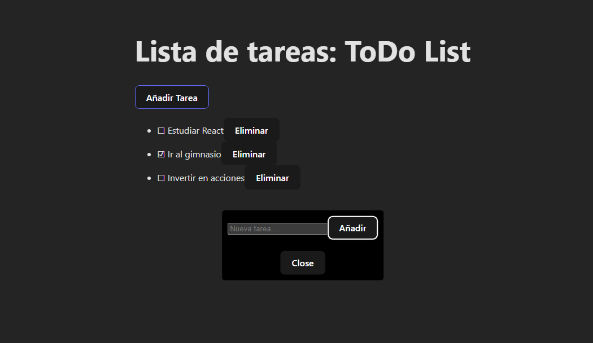

# Screenshot of the App

</img>


# React Task App with JSON Server

This is a simple task management application built with **React**, **TypeScript**, and **Vite**. It uses **JSON Server** as a mock backend to manage tasks with basic CRUD operations.

## Tech Stack

- **React**: A JavaScript library for building user interfaces.
- **TypeScript**: A strongly typed superset of JavaScript.
- **Vite**: A fast build tool for modern web development.
- **JSON Server**: A simple, full fake REST API for testing and prototyping.

## Getting Started

### Prerequisites

Before you start, make sure you have the following installed:

- [Node.js](https://nodejs.org/) (>= 14.0.0)
- [npm](https://www.npmjs.com/) or [yarn](https://yarnpkg.com/)

### 1. Clone the Repository

```bash
git clone https://github.com/yourusername/task-app.git
cd task-app
```

### 2. Install Dependencies
First, install the project dependencies:

```bash
npm install
```
# or if you're using yarn
```
yarn install
```
### 3. Setting Up JSON Server
In order to simulate a backend for the tasks, this project uses json-server.

Make sure you have json-server installed globally or locally. If you don't have it, install it globally via npm:

```bash
npm install -g json-server
```
Then, create a db.json file in the root of your project to store your tasks:

```json
{
  "tasks": [
    {
      "id": 1,
      "description": "Learn React",
      "done": false
    },
    {
      "id": 2,
      "description": "Build a To-Do app",
      "done": true
    }
  ]
}
```
### 4. Start JSON Server
Start the JSON Server by running the following command:

```bash
json-server --watch db.json --port 5000
```
This will start a local server at http://localhost:5000 where your tasks data will be stored. JSON Server will automatically generate the following routes:

GET /tasks - Get all tasks

GET /tasks/{id} - Get a task by ID

POST /tasks - Add a new task

PUT /tasks/{id} - Update a task by ID

DELETE /tasks/{id} - Delete a task by ID

### 5. Start the Development Server
In another terminal window, start your React app with Vite:

```bash
npm run dev
# or if you're using yarn
yarn dev
```
Your React application should now be running at http://localhost:3000.

### 6. Testing the Application
Now, you can use the task management app to perform actions like:

Viewing tasks (GET)

Adding new tasks (POST)

Editing tasks (PUT)

Deleting tasks (DELETE)

All of the tasks are handled in real-time, and any changes you make will be reflected both in the UI and the json-server mock backend.

### 7. Optional: Build the Project
If you're ready to deploy or want to create a production build, run the following command to bundle your application:

```bash
npm run build
# or if you're using yarn
yarn build
```
This will create a dist/ folder with the optimized, production-ready build of your app.